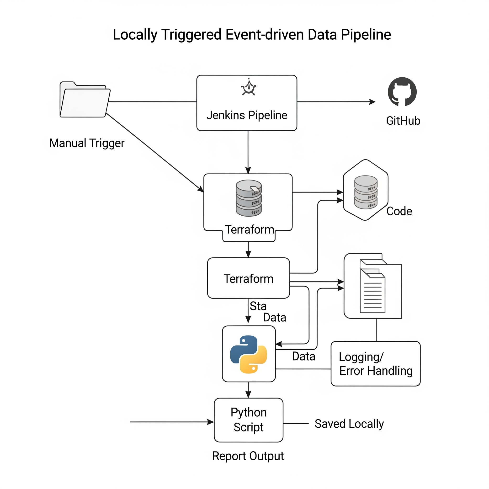

# Event-Driven Data Pipeline

## 📁 Project Structure

## 📌 Overview

This project implements a **locally-triggered event-driven data processing pipeline** that:

- Captures incoming data
- Processes it using a Python script
- Generates a daily summary report
- Is fully automated using Jenkins and Terraform

## 🔧 Components

- **Jenkins**: Orchestrates the CI/CD pipeline manually triggered by the user
- **Terraform**: Provisions infrastructure if required
- **Python**: Handles ETL and report generation
- **Manual Trigger**: Starts the Jenkins job from the user interface or command

## ⚙️ Pipeline Flow

1. Manual trigger starts the pipeline via Jenkins
2. Jenkins runs Terraform to provision/update infrastructure
3. Python script is executed to process data
4. A daily summary report is generated and saved locally
5. Logs and errors are captured within Jenkins and the Python script

## 📁 Folders

- `terraform/`: Infrastructure as code
- `jenkins/`: Jenkinsfile for CI/CD pipeline
- `report_generator/`: Python script for report generation

